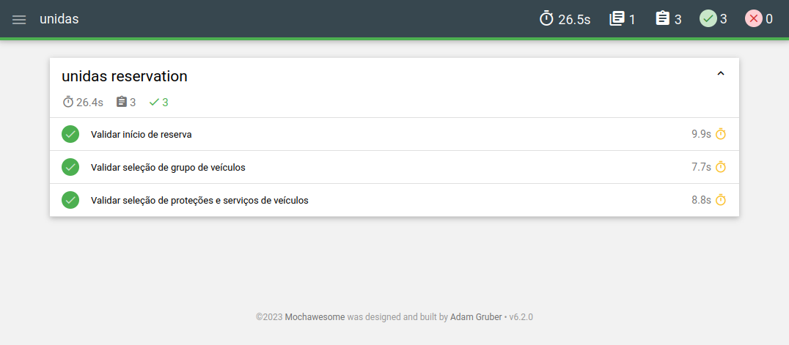

# unidas

No plano de testes inicial ainda há poucos cenários (nenhum fluxo secundário ou de exceção).
Ele pode ser visto no arquivo de _specs_ [reserva.cy.js](./cypress/e2e/reserva.cy.js).

Foi gerado um relatório usando o mochawesome*:

*A versão completa pode ser baixada na pasta **mochawesome-report**

O vídeo da execução pode ser conferido abaixo (ou no diretório cypress/videos):

https://raw.githubusercontent.com/gustavo-almeida/unidas/main/cypress/videos/reserva.cy.js.mp4

Essa é apenas uma demonstração, pois num cenário real há muitas melhorias para serem feitas no processo de automação e também no código.
